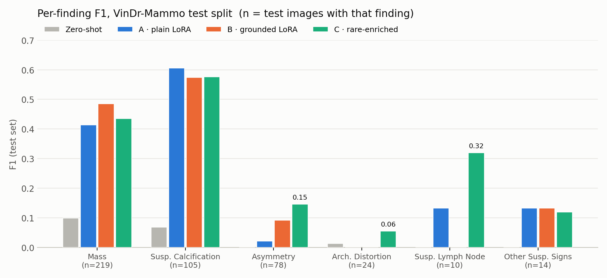

# Grounded vision-language models for mammography (VinDr-Mammo)

Fine-tuning **Qwen2.5-VL-7B** with LoRA:
- reads mammogram
- gives a BI-RADS score and density categorization
- names suspicious findings
- localizes finding with a bounding box

This repo contains:
1. **Reproduction:** I re-ran the lab's single-image pipeline end to end (Models A/B/C, zero-shot, YOLO11s baseline) on the public VinDr-Mammo dataset. The pipeline was designed by Sonya Henry at Montefiore ([credits](#credits)).
2. **Extension:** A bilateral version where the model sees the left and right breast (same view) together, the way a radiologist compares sides when looking for asymmetry. Status: trained and evaluated; so far it doesn't beat single-image input, see [below](#extension-bilateral-lr-input).

---

## Results (VinDr-Mammo official test split: 1,000 studies / 4,000 images)

| Model | Modifications | BI-RADS acc (κw) | Density acc (κw) | Finding macro-F1 | Mean IoU (IoU@0.5) |
|---|---|---|---|---|---|
| Zero-shot Qwen2.5-VL-7B | none | 0.471 (−0.02) | 0.211 (0.00) | 0.030 | – |
| A · plain LoRA | text targets only | 0.766 (0.56) | 0.845 (0.62) | 0.218 | – |
| B · grounded LoRA | + `<box>` tokens + per-finding grounding task | 0.773 (0.58) | 0.831 (0.55) | 0.214 | 0.371 (0.429) |
| C · rare-enriched | B + 1 epoch on a normal-capped, repeat-factor-sampled set at 10× lower LR | 0.733 (0.55) | 0.839 (0.60) | 0.275 | 0.368 (0.434) |

κw = quadratic-weighted Cohen's kappa. IoU is from the single-finding grounding task (482 test boxes). Full tables are in [`results/`](results/).




Conclusions:
- Grounding costs almost nothing on the global tasks. Model B matches A on BI-RADS and density and can also localize findings.
- Model C trades precision for recall. If you binarize to "flag for follow-up", sensitivity goes from 0.38 (B) to 0.57 (C), and false positives go from 57 to 324 ([`results/binary_suspicion.csv`](results/binary_suspicion.csv)).
- The rare-class gains sit on very small numbers (e.g Suspicious Lymph Nodes have 10 test images)
- YOLO11s isn't a fair head-to-head (YOLO11 mAP50 = 0.034 on calcifications; VLMs F1 ≈ 0.57, but measure different things). YOLO reported separately ([`results/yolo11s_baseline.csv`](results/yolo11s_baseline.csv)).
= The zero-shot model writes reports that look completely professional, but its BI-RADS agreement is below chance (κw −0.02) => clearest argument for grounding the model with bounding boxes.

---

## Extension: bilateral (L+R) input

**Notebook:** [`notebooks/04_bilateral_multiimage.ipynb`](notebooks/04_bilateral_multiimage.ipynb) · **Tested code:** [`src/mammo_vlm/bilateral.py`](src/mammo_vlm/bilateral.py)

Asymmetry is by definition a comparison between sides and was one of the weakest classes (F1 ≤ 0.15). I regrouped VinDr by `(study_id, view_position)`: each example is the left and right CC (or left and right MLO) from one patient.

| Question | Decision | Why |
|---|---|---|
| Pairing | Same view, L + R (not CC + MLO of one side) | Radiologists compare the same view of both breasts, and asymmetry is defined against the other side. If the model looked at the CC + MLO of one breast, it would need to know spatially which findings in one view are the same ss in the other and VinDr has no ID linking them |
| BI-RADS / density | Reported per breast | VinDr labels them per breast, so a patient may have BI-RADS 1 on the left and 4 on the right. While shadowing, I learned that if either is flagged as suspicious (3+), the patient is called back. |

Data: 7,198 train / 800 val / 2,000 test pairs, built with the **same seed and study-level split** as A/B/C, so the test patients are identical.

**Results (first training run, evaluated on all 2,000 test pairs / 4,000 breasts; scored in section 12 of [notebook 04](notebooks/04_bilateral_multiimage.ipynb)):**

| Metric | Bilateral (L+R pair) | Model B (single image, reference) |
|---|---|---|
| BI-RADS acc, per breast (κw) | 0.712 (0.47) | 0.773 (0.58) |
| Density acc, per breast (κw) | 0.830 (0.58) | 0.831 (0.55) |
| Finding macro-F1 (per pair, any side) | 0.161 | 0.214 |
| Asymmetry F1 | 0.047 | 0.092 |
| Mean IoU (IoU@0.5) | 0.228 (0.212) | 0.371 (0.429) |
| Box placed on the correct image | 0.801 | – |

So far, pairing doesn't help. Density matches single-image B, but everything else is lower, and asymmetry (the class this extension targets) is worse. Grounding drops the most: the model puts the box on the wrong image about 20% of the time, and requiring the correct image barely changes IoU (0.227), so most of the gap is box placement itself. Findings are scored per pair and B per image, so those rows aren't directly comparable; the test patients are the same.

**Modifications in progress:**
| Idea | Motivation |
|---|---|
| Evaluate third run with specific side-tagging | Makes a side-aware finding score possible. |
| Compute loss on the answer tokens only | Right now the system and user prompt are in the loss too, so much of each training step goes to re-learning the same fixed prompt. All models share this setup, so it shouldn't skew the comparisons, but the box tokens get very little weight, which may be one reason grounding is weak (along with small findings and image downscaling). Adding answer-only loss changes one thing without changing the rest of the setup; an ablation is planned. |
| Check per-image resolution in pairs vs. single images | Grounding dropped the most (IoU 0.228 vs. 0.371). If two images split the model's image-token budget, each one gets downscaled. |
| Start from Model B's adapter instead of the base model | Replicate how Model C builds on B. |

---

## Pipeline

```mermaid
flowchart LR
    A[VinDr-Mammo CSVs<br/>breast-level + finding-level] --> B[Group 10 finding types<br/>into 6 classes]
    B --> C[Study-level split<br/>official test + 10% val]
    C --> D[Scale boxes<br/>DICOM → PNG → 0–1000]
    D --> E[Instruction JSONL<br/>4 tasks per image]
    E --> F[LoRA SFT<br/>Qwen2.5-VL-7B, r=16]
    F --> G[Greedy decoding<br/>on test split]
    G --> H[Parse text → labels / boxes<br/>F1, κw, IoU]
```



Four tasks per image: **finding classification**, **BI-RADS + density**, **report** (plain for A, box-grounded for B/C), and **single-finding grounding** ("Locate Mass. *A mammographic mass is a space-occupying lesion…*") for B/C.

Training config (same for A/B and bilateral): LoRA r=16, α=32, dropout 0.05 on all attention and MLP projections; bf16; effective batch 8; LR 1e-4 cosine; 2 epochs; single H200. Model C: 1 epoch at 1e-5 from the B adapter.

---

## Repo layout

```
notebooks/
  01_models_A_B_and_yolo.ipynb           data prep, Model A training, YOLO11s, binary-suspicion eval
  02_model_B_eval_zeroshot_reports.ipynb Model B eval, zero-shot baseline, narrative report format
  03_model_C_rare_enriched.ipynb         rare-enriched set + continued fine-tuning
  04_bilateral_multiimage.ipynb          my L+R extension
src/mammo_vlm/                           
  labels.py  splits.py  boxes.py  bilateral.py  metrics.py
tests/                                   pytest, synthetic fixtures only (no images, no GPU)
results/                                 metric tables as CSV
```

The notebooks are my actual research log and what ran on the cluster. `src/` has the pure functions pulled out with tests.

---

## How to run:

**Data.** VinDr-Mammo is access-controlled on [PhysioNet](https://physionet.org/content/vindr-mammo/1.0.0/). To reproduce: convert the DICOMs to PNG, then:

```bash
export VINDR_ROOT=/path/to/vindr_mammo   # PhysioNet folder + png/
```

**Tests** (no data or GPU needed):

```bash
pip install -e ".[dev]"
pytest          # 27 tests
```

**Training / eval:** `pip install -e ".[train]"`, then run the notebooks in order on a GPU with ~80 GB (I used one H200). Model A (2 epochs, 10,800 optimizer steps) took 20 h 47 min on one H200; Model C's single continued epoch (4,219 steps) took 8 h.

---

## Credits
- Original pipeline design: Sonya Henry.
- Clinical perspective: Dr. Takouhie Maldjian, MD.
- Dataset: Nguyen, H.T. et al. *VinDr-Mammo: A large-scale benchmark dataset for computer-aided diagnosis in full-field digital mammography.* Scientific Data 10, 277 (2023).
- Base model: Qwen2.5-VL-7B-Instruct (Qwen team). Training uses Hugging Face `transformers`, `peft`, `trl`.

My contributions: re-running and cleaning the A/B/C pipeline, the bilateral extension, the tested `src/` package, and the eval fixes.